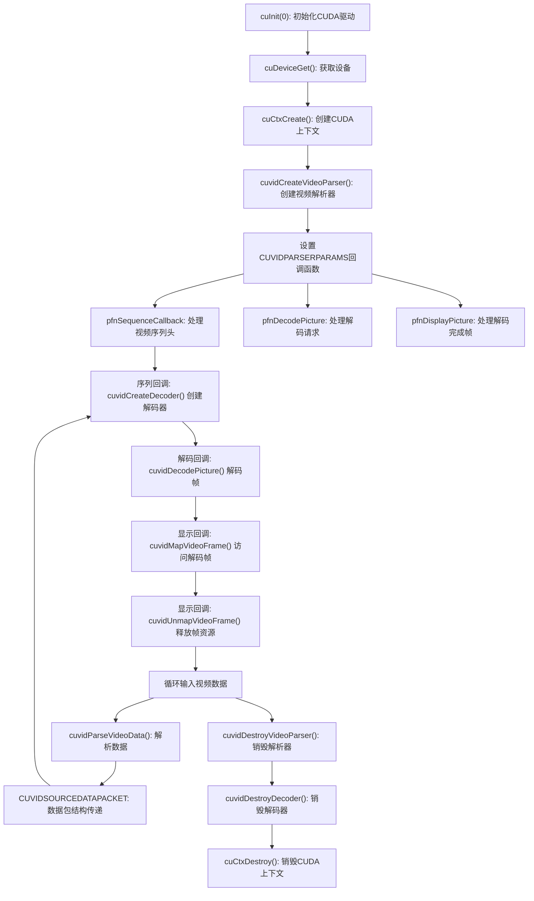

一.cuvid 的函数列表

``` shell
libvgpu#ldconfig -p | grep libnvcuvid
        libnvcuvid.so.1 (libc6,x86-64) => /lib/x86_64-linux-gnu/libnvcuvid.so.1

```

```
libvgpu#nm -D /lib/x86_64-linux-gnu/libnvcuvid.so.1 | cut -c 17- | grep -E '(Nv|cuvid)'
 T NvToolCreateInterface
 T NvToolDestroyInterface
 T NvToolGetApiFunctionCount
 T NvToolGetApiID
 T NvToolGetApiNames
 T NvToolGetInterface
 T NvToolSetApiID
 T NvToolSetInterface
 T cuvidConvertYUVToRGB
 T cuvidConvertYUVToRGBArray
 T cuvidCreateDecoder
 T cuvidCreateVideoParser
 T cuvidCreateVideoSource
 T cuvidCreateVideoSourceW
 T cuvidCtxLock
 T cuvidCtxLockCreate
 T cuvidCtxLockDestroy
 T cuvidCtxUnlock
 T cuvidDecodePicture
 T cuvidDestroyDecoder
 T cuvidDestroyVideoParser
 T cuvidDestroyVideoSource
 T cuvidGetDecodeStatus
 T cuvidGetDecoderCaps
 T cuvidGetSourceAudioFormat
 T cuvidGetSourceVideoFormat
 T cuvidGetVideoSourceState
 T cuvidMapVideoFrame
 T cuvidMapVideoFrame64
 T cuvidParseVideoData
 T cuvidPrivateOp
 T cuvidReconfigureDecoder
 T cuvidSetVideoSourceState
 T cuvidUnmapVideoFrame
 T cuvidUnmapVideoFrame64
```

